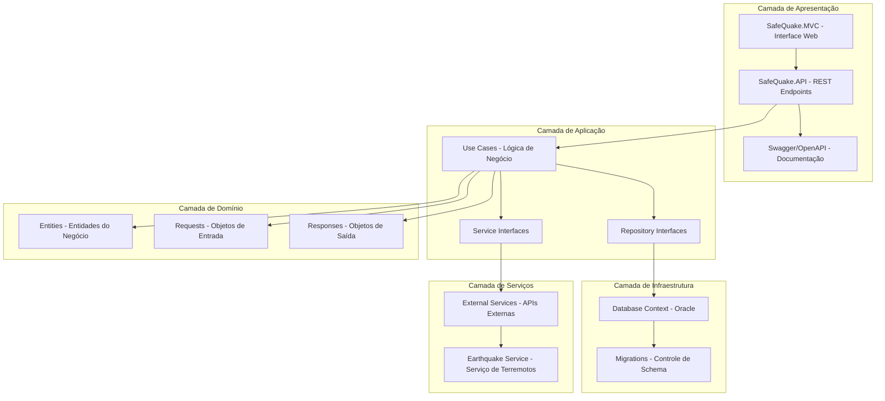
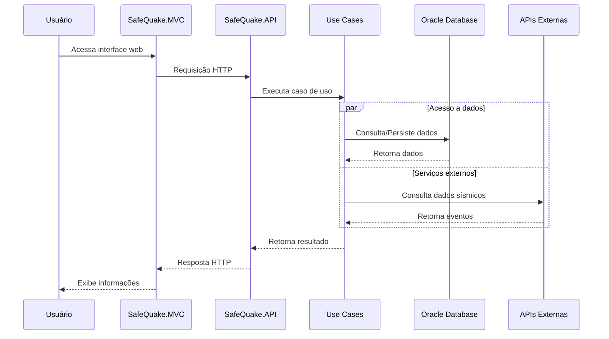

# 🌀 SafeQuake API 

## Sobre o Projeto
Este é um projeto acadêmico desenvolvido para a FIAP com foco em eventos extremos. Nossa escolha foi desenvolver uma API para eventos sísmicos (terremotos) chamada SafeQuake.

## 🧑‍💻 Desenvolvedores - 2TDSPX
- [RM558948] [Allan Brito Moreira](https://github.com/Allanbm100)
- [RM558868] [Caio Liang](https://github.com/caioliang)
- [RM98276] [Levi Magni](https://github.com/levmn)

## Objetivo
O SafeQuake é uma API desenvolvida para monitorar, registrar e gerenciar informações sobre eventos sísmicos. O sistema permite o acompanhamento de terremotos em tempo real, fornecendo dados cruciais para tomada de decisões e alertas de segurança.

## Estrutura do Projeto
O projeto segue uma arquitetura em camadas e está organizado da seguinte forma:

```
safequake-api/
├── SafeQuake.API/
│   ├── Controllers/
│   └── Properties/
│
├── SafeQuake.Application/
│   ├── Interfaces/
│   └── UseCases/
│
├── SafeQuake.Domain/
│   ├── Entities/
│   ├── Requests/
│   └──Responses/
│
├── SafeQuake.Infrastructure/
│   ├── Migrations/
│   ├── Persistence/
│   └── .env.sample
│
├── SafeQuake.MVC/
│   ├── Controllers/
│   ├── Models/
│   ├── Properties/
│   ├── Views/
│   ├── wwwroot/
│   └── Program.cs
│
└── SafeQuake.Service/
    ├── Interfaces/
    ├── Models/
    └── Services/
```

## Fluxo do Projeto
Os diagramas abaixo ilustram o fluxo de dados e a interação entre as diferentes camadas do projeto:



### Explicação do Fluxo
1. **Camada de Apresentação**
   - A interface MVC e a API servem como pontos de entrada da aplicação
   - Swagger fornece documentação interativa e teste dos endpoints da API
   - Os Controllers delegam as operações para os Use Cases apropriados

2. **Camada de Aplicação**
   - Use Cases implementam a lógica de negócio
   - Define interfaces para repositórios (IRepo) e serviços externos (IServ)
   - Utiliza entidades do domínio e objetos de Request/Response

3. **Camada de Domínio**
   - Contém as entidades centrais do negócio
   - Define os objetos de Request e Response
   - Representa o núcleo da aplicação, independente de infraestrutura

4. **Camada de Infraestrutura**
   - Implementa as interfaces de repositório definidas na camada de aplicação
   - Gerencia o contexto do banco de dados Oracle
   - Controla as migrações do banco de dados

5. **Camada de Serviço**
   - Fornece serviços externos, como o serviço de terremotos
   - Implementa as interfaces de serviço definidas na camada de aplicação
   - Gerencia a comunicação com APIs externas

### Fluxo de execução



## Configuração do Ambiente

### Requisitos
- .NET Core SDK
- Oracle Database
- Visual Studio ou Visual Studio Code

### Configuração do Banco de Dados
1. Certifique-se de ter o Oracle Database instalado e em execução
2. Configure as strings de conexão no arquivo `.env`

### Arquivos de Configuração
1. Crie uma cópia do arquivo `.env.sample` e renomeie para `.env`
2. Configure as seguintes variáveis no arquivo `.env`:

```env
    DB_USER=
    DB_PASSWORD=
    DB_HOST=oracle.fiap.com.br
    DB_PORT=1521
    DB_SID=ORCL
```

## Como Executar o Projeto

1. Clone o repositório:
```bash
git clone https://github.com/levmn/safequake-api.git
cd safequake-api
```

2. Restaure os pacotes:
```bash
dotnet restore
```

3. Execute as migrações do banco de dados:
```bash
cd SafeQuake.Infrastructure
dotnet ef database update
```

4. Execute a API (em um terminal):
```bash
cd SafeQuake.API
dotnet run
```
A API estará disponível em `http://localhost:5049`

5. Execute o projeto MVC (em outro terminal):
```bash
cd SafeQuake.MVC
dotnet run
```
O projeto MVC estará disponível em `http://localhost:5027`

> ⚠️ **Importante**: É necessário manter tanto a API quanto o projeto MVC em execução simultaneamente para o funcionamento completo da aplicação.

### Portas Padrão
- API: http://localhost:5049
- MVC: http://localhost:5027

Se precisar alterar as portas, você pode fazer isso nos arquivos:
- API: `SafeQuake.API/Properties/launchSettings.json`
- MVC: `SafeQuake.MVC/Properties/launchSettings.json`

### Testando a Aplicação
1. Acesse o projeto MVC em `http://localhost:5027`
2. Crie uma nova conta usando a opção "Cadastrar"
3. Faça login com suas credenciais
4. Explore as funcionalidades:
   - Dashboard com alertas recentes
   - Listagem de terremotos
   - Registro de novos eventos sísmicos
